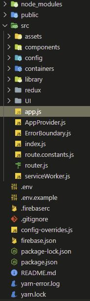
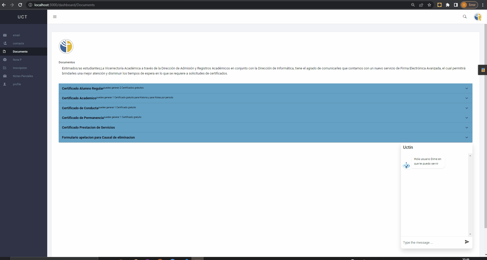
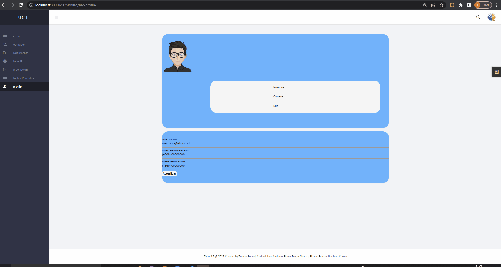

# Taller de integracion 4-2 Proyecto 4 Portal Del Estudiante

En el siguiente apartado expecificaremos la Documentacion aplicada en el desarrollo del Proyecto :
* Frontend `React,react-Hook,react-redux,react-router-dom,yarn` entre muchas otras herramientas de diseño y funcionalidad para Fronend.
* Backend `Lavaravel v7,php7.4.3,sqlserver,dompdf`entre muchas otras herramientas para el pleno desarrollo del backend y su funcionalidad.


Para el conocimiento publico de este repositorio se pueden orientar con la siguiente Documentacion.

Documentacion:
* [React](https://es.reactjs.org/)
* [Laravel](https://laravel.com/)
* [SqlServer](https://cloudblogs.microsoft.com/sqlserver/)
* [Mui](https://mui.com/)
* [Chatbot](https://lucasbassetti.com.br/react-simple-chatbot/)
* [Bashooka-ejemplos](https://bashooka.com/?s=react)
* [Composer](https://getcomposer.org/)
* [Migrate](https://laravel.com/docs/9.x/migrations)

# Apartado FrontEnd:

Para este proyecto desidimos implementar React , por su curva de aprendisaje rapido , autonomo e intituivo , por esta razon tomamos un tema css el cual implementamos y llevamos a react en un portal del estudiante fijado en un Dashboard , como Primera instancia el redisello y busqueda de modelos fue bastante amplio pero una vez ideado , la puesta en marcha ya fue accesible .

* Primer paso Instalacion de Yarn , es necesario tener Yarn como ruta global dentro del equipo para poder ejecutar el proyecto , esto facilita el manejo de modulos y su referente instalaicion:
  
`Yarn`

* Luego de que yarn se encarga de instalar todos nuestros modulos y dependencias necesarias necesitamos que yarn construya el proyecto:
  
`Yarn Build`

* Finalmente para iniciar nuestro Proyecto:
 
`Yarn Start`

Luego de iniciado nuestro proyecto , ya podemos empezar a codificar dentro de el , lo primero que podemos observar es que en el archivo `package.json` estan todos los modulos necesarios ya instalados y funcionando , para este proyecto nos decantamos por el uso de `React-Redux`. Con el uso de `Redux` podemos optar a una variante de react para proyectos de los cuales es necesaria la implementacion en variadas plataformas pero sobre todo la reutilizacion de codigo y la optimizacion del mismo , de igual forma los `Hooks` de `React` lo llevan a tener una mayor ventaja sobre el uso de Script clasicos , un ejemplo de esto es el uso del conocido `Onclick`el cual se puede vizualisar de la siguiente forma en nuestro proyecto .

```csharp
import { useEffect } from 'react';

    function useOnClickOutside(ref, handler) {
      useEffect(() => {
        const listener = event => {
          if (!ref.current || ref.current.contains(event.target)) {
            return;
          }
          handler(event);
        };
    
        document.addEventListener('mousedown', listener);
        document.addEventListener('touchstart', listener);
    
        return () => {
          document.removeEventListener('mousedown', listener);
          document.removeEventListener('touchstart', listener);
        };
      }, [ref, handler]);
    }

export default useOnClickOutside;
```
Con este paso por delante nos ahorramos tiempo y procesamiento en las jquerys basicas , para pasar derechamente al codigo de nuestro proyecto en donde tenemos un archivo `App.js ` central y un muy importante `router.js` el cual es nuestro enrutador principal , pero sobre bajo a este tenemos otros dos enrutadores para el `dashboard`y el `sidebar`.

Como manejo de archivos para nuestro proyecto ocupamos 


A continuacion presentaremos nuestro 

*Dashboard Home


*Documentos


*Perfil y Selector de color 


Estas Son algunad de las vistas de nuestro Proyecto.


# Apartado Backend

Para la la sección de backend cabe desatacar que necesario contal con la instalción de componser, para ello nos podemos dirigir directamente a [https://getcomposer.org/](https://getcomposer.org/) para descargar este gestor de paquete para PHP, es necesario recalcar que en las variables de entorno debe de encontrarse etiquetada para poder ser llamado desde consola y permitirnos crear las apliaciones con Laravel.

Para el caso una vez descargado, devemos asegurarnos de tener configurado correctamtente nuestro archivo **.env** en donde vamos a especificar el acceso a la base de datos de SQLserver. Concretado eso procedemos a entablar la accion de migración de las tablas previamente proporcionadas utilizando el comando:

`php artisan migrate`

Una vez dispuesto el comando nos dirigimos a nuestro gestor de base de datos para poder asignas las claves foraneas.

Para el caso se encuentran a disposición ya listos los controladores, por ello, solo queda comenzar a hacer pruebas para ver la interacición que tienen con la base con la base de datos y el frontend. Arrancamos entonces el servidor de api creado con Laravel utilizando el comando `php artisan serve`.

Las accciones que se concretaron para el backend son, Login, creción de documentos pdf en base a plantillas html, extranción de datos de usuario para cargarlos en su perfil.

### Propuestos faltantes
Entre algunas de los pruestos que no fueron realizados encontramos:

* Crear un modulo de contactos, cargando los contactos de los profesores a los cuales pertenecen los ramos que actualmente se encuentre cursando el estudiante.
    
* Mejorar el sistema de inscripción de cursos en donde se selecicionen todos los cursos de una sola oprtunidad en una sola lista, de esta forma el proceso solo se hace una vez y se incribe todo lo necesario en una sola ocación.